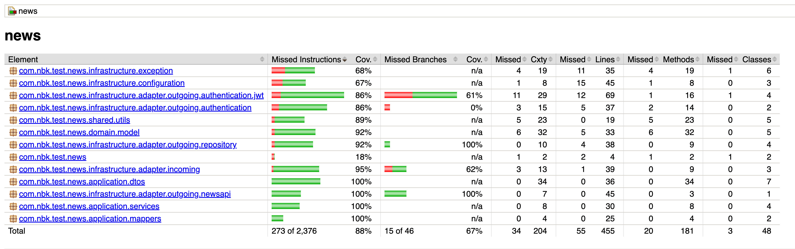

# NBK News and File download Service

This is a sample Spring Boot application to provide News APIs to be consumed by the Mobile Apps.

## Description

The application exposes a REST API for getting news articles from news api and allows for file download given a specific
url. Its developed using various libraries that allow for behavior driven development.

## Documentation

### Project Structure

The project follows the Clean Architecture paradigm that emphasizes the separation of concerns and the independence of
different layers in an application. 

In this project, the Clean Architecture is implemented with the following folder structure:

* application: Contains business logic use cases, has the service classes that power the application, act as glue between our
  endpoints and repository sources of data.

* domain: Contains the business rules and various entities core to the app.

* infrastructure: Contains the adapter implementations for incoming (our controllers endpoints) and
  outgoing (request to newsapi for data) communication and the REST interface.
  The application specific configuration also found here, include Logging Aspect, OpenApiConfig and setup files
  Controller advice and app exceptions are defined here too.

* tests: Located within the src/test directory (intg -> integration, unit -> unit and bdd -> behaviour tests)


### Development

The application was developed using Spring Boot version 3.1.2 and Kotlin. Below describe various functionalities on app
different functionalities:

#### Main
* Authentication and Roles: Setup using json web token and uses spring-security, nimbus-jose-jwt and jwt (token generation and 
  validation), jbcrypt (password hash). Users are defined in `users.properties` file (setup minimal auth mechanism)
  and loaded to app on startup.

* Internationalization (i18n): Set on the application and messages defined in `messages.properties` file.

* Logging: Application relies heavily on Logging aspect that logs within controller and service methods `LoggingAspect`
  (used as aspect as logs aren't a core part of the application). A request is logged from start till response and 
  execution time is logged to.

  Use logback library and a defined logback config in `logback-spring.xml` that defines a console
  log for `development/staging` and a rolling file log in `uat/prod`

* Documentation: Setup using springdoc-openapi and exposes endpoints available in the application. Swagger documentation
  is accessible via http://localhost:8080/swagger-ui/index.html


#### Test
* bdd package: Cucumber for BDD testing. Rest-assured for easier api call handling within step definitions.

* Spring security to handle authentication of our controller tests

* Mockito and junit used within integration and unit testing package to set up the tests and assertions.


### Building and Running the Application

To build and run the application, follow these steps:
  1. Navigate to the root directory of the project.
  2. Run the following command to clean and build the application: ```./mvnw clean install```
  3. Run the following command to start the application: ```java -jar target/news-0.0.1-SNAPSHOT.jar```
  4. The application will start on port 8080. You can access the REST API by using the shared Postman Collection. 

  5. Do navigate to ```localhost:8080/api/v1/login``` and use payload below to get the token.
         ```{
             "username": "user1",
             "password": "password1"
         }```
  6. Do set Authorization property and Bearer token as value from above request.
  7. Postman collection for entire project is in root folder named as `NewsApi.postman_collection.json`  

### Code Coverage

To generate the code coverage report, run the following command:  ```./mvnw test && ./mvnw jacoco:report```

Current report at 88% test coverage (Missing are DTO and configurations)




### Conclusion

This shows a project setup with Clean Architecture, follows SOLID principles, Authentication and Authorization setup with
tests covering all application layers.

#### Improvements
  1. Add persistence to set up users correctly instead of using properties file.
  2. Add application monitoring for cpu resources. 

